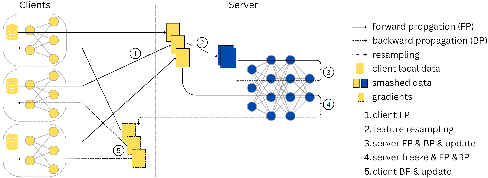

# CycleSL

> **CycleSL: Server-Client Cyclical Update Driven Scalable Split Learning**.

> CycleSL is a novel scalable split learning paradigm that can be integrated into existing scalable split learning methods such as PSL and SFL to improve convergence rate and quality while burdening the server even less and providing the same privacy guarantee.

## 🖼️ Teaser

## 🗼 Pipeline
After receiving smashed data from clients, CycleSL first forms a global dataset on the server side using the client features following a feature-as-sample strategy. Then CycleSL re-samples mini-batches from the dataset and feeds them into the server part model to train the model. Only after the server part model is updated, the original feature batches are re-used to compute gradients using the latest server side model. In the next the gradients are sent back to clients for client part model update.

## 💁 Usage
1. Download data and conduct data preprocessing following the instructions given in the `data` directory.

2. Create conda environment with `conda env create -f environment.yml` and then activate the environment with `conda activate cyclesl`.

3. Run `experiments.sh` to reproduce our experiments.

For detailed argument and hyperparameter settings please check `utils.py`. 

## 🔧 Environment
Important libraries and their versions by **April 29th, 2025**:

| Library | Version |
| --- | ----------- |
| Python | 3.12.7 by Anaconda|
| PyTorch | 2.5.1 for CUDA 12.4 |
| Scikit-Learn | 1.6.0 |
| WandB | 0.19.1 |

Others:
- The program should be run a computer with at least 16GB RAM. If run on NVIDIA GPU, a minimum VRAM requirement is 8GB. We obtained our results on a cluster with AMD EPYC 7763 64-Core and NVIDIA A100 80GB PCIe x 4.

- There is no requirement on OS for the experiment itself. However, to do data preprocessing, Python environment on Linux is needed. If data preprocessing is done on Windows Subsystem Linux (WSL or WSL2), please make sure `unzip` is installed beforehand, i.e. `sudo apt install unzip` for WSL2 Ubuntu.

- We used [Weights & Bias](https://wandb.ai/site) for figures instead of tensorboard. Please install it (already included in `environment.yml`) and set up it (run `wandb login`) properly beforehand.

- We used the Python function `match` in our implementation. This function only exists for Python version >= 3.10 (Python 3.12.7 already included in `environment.yml`). Please replace it with `if-elif-else` statement if needed.

## 🗺 Instructions on data preprocessing
We conducted experiments using four datasets: FEMNIST, CelebA, Shakespeare, and CIFAR-100 (the OpenImage and CIFAR-10 tasks were deprecated). The first three datasets can be obtained from [LEAF](https://leaf.cmu.edu/) together with bash code for reproducible data partition and train-test split. The CIFAR-100 dataset was downloaded and partitioned with [FL-bench](https://github.com/KarhouTam/FL-bench/tree/master).

Please dive into the `data` directory for further instructions.
